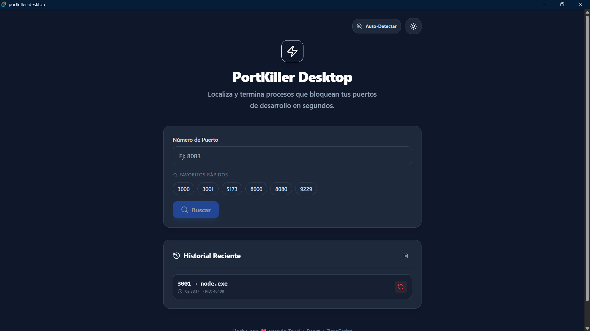
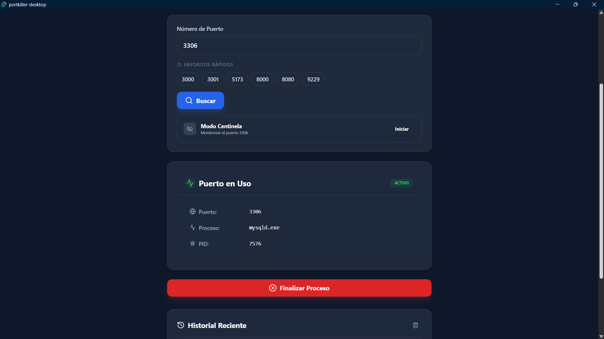

# PortKiller Desktop

[](https://github.com/Bjohan23/portkiller-desktop/releases)
[](LICENSE)
[](#plataformas-soportadas)
[](https://tauri.app/)
[](https://www.typescriptlang.org/)
[](https://react.dev/)

Aplicación de escritorio para encontrar y eliminar procesos que ocupan puertos específicos. Desarrollada con Tauri v2, React y TypeScript.

## Capturas de Pantalla

<p align="center">
  
</p>

<p align="center">
  
</p>

---

## Tabla de Contenidos

- [Características](#características)
- [Plataformas Soportadas](#plataformas-soportadas)
- [Instalación](#instalación)
- [Uso](#uso)
- [Desarrollo](#desarrollo)
- [Stack Tecnológico](#stack-tecnológico)
- [Estructura del Proyecto](#estructura-del-proyecto)
- [Contribuir](#contribuir)
- [Solución de Problemas](#solución-de-problemas)
- [Licencia](#licencia)
- [Autor](#autor)

---

## Características

- **Búsqueda por puerto**: Localiza qué proceso está usando un puerto específico
- **Detección automática**: Escaneo de puertos comunes (3000, 3306, 5432, 8080, etc.)
- **Modo Centinela**: Monitoreo continuo con notificaciones cuando un puerto cambia de estado
- **Información detallada**: Muestra PID, nombre del proceso, ruta, framework detectado
- **Eliminación segura**: Confirmación antes de terminar procesos
- **Detección de frameworks**: Identifica Node.js, Python, Java, .NET, Go, PHP, Docker
- **Tema oscuro/claro**: Interfaz adaptable a tus preferencias
- **Multiplataforma**: Funciona en Windows, macOS y Linux

---

## Plataformas Soportadas

| Plataforma | Arquitectura | Estado |
|------------|--------------|--------|
| Windows 10/11 | x64 | Estable |
| macOS | Intel (x86_64) | Estable |
| macOS | Apple Silicon (arm64) | Estable |
| Linux | x64 | Estable |

---

## Instalación

### Opción 1: Descargar Release

Descarga el instalador para tu sistema desde [Releases](https://github.com/Bjohan23/portkiller-desktop/releases):

- **Windows**: `portkiller-desktop_x.x.x_x64-setup.exe` o `.msi`
- **macOS**: `portkiller-desktop_x.x.x_x64.dmg` o `_aarch64.dmg`
- **Linux**: `portkiller-desktop_x.x.x_amd64.AppImage` o `.deb`

### Opción 2: Compilar desde Código Fuente

#### Requisitos

- [Node.js](https://nodejs.org/) 18+
- [Rust](https://rustup.rs/) 1.70+
- [Visual Studio C++ Build Tools](https://visualstudio.microsoft.com/visual-cpp-build-tools/) (solo Windows)

#### Pasos

```bash
# Clonar repositorio
git clone https://github.com/Bjohan23/portkiller-desktop.git
cd portkiller-desktop

# Instalar dependencias
npm install

# Ejecutar en desarrollo
npm run tauri dev

# Compilar para producción
npm run tauri build
```

Los instaladores se generan en `src-tauri/target/release/bundle/`

---

## Uso

1. **Buscar puerto**: Ingresa el número de puerto y presiona "Buscar"
2. **Ver información**: Si el puerto está en uso, verás los detalles del proceso
3. **Terminar proceso**: Click en "Finalizar Proceso" y confirma la acción
4. **Modo Centinela**: Activa el monitoreo para recibir notificaciones cuando el estado cambie

### Permisos de Administrador

Algunos procesos del sistema requieren privilegios elevados para ser terminados:

- **Windows**: Click derecho en la app → "Ejecutar como administrador"
- **macOS/Linux**: Ejecutar con `sudo` desde terminal

---

## Desarrollo

```bash
# Modo desarrollo con hot-reload
npm run tauri dev

# Solo frontend
npm run dev

# Build de producción
npm run tauri build

# Verificar tipos TypeScript
npm run type-check

# Limpiar build
npm run tauri clean
```

---

## Stack Tecnológico

| Capa | Tecnología |
|------|------------|
| Framework Desktop | Tauri v2 |
| Backend | Rust |
| Frontend | React 18 |
| Lenguaje | TypeScript 5 |
| Bundler | Vite |
| Estilos | Tailwind CSS |
| Iconos | Lucide React |
| Sistema | sysinfo (Rust crate) |

---

## Estructura del Proyecto

```
portkiller-desktop/
├── src/                      # Frontend React
│   ├── components/           # Componentes UI
│   ├── services/             # Servicios (comunicación con Tauri)
│   ├── types/                # Definiciones TypeScript
│   └── App.tsx               # Componente principal
│
├── src-tauri/                # Backend Rust
│   ├── src/
│   │   ├── lib.rs            # Lógica de negocio
│   │   └── main.rs           # Entry point
│   ├── Cargo.toml            # Dependencias Rust
│   └── tauri.conf.json       # Configuración Tauri
│
├── .github/workflows/        # CI/CD
│   └── release.yml           # Build multiplataforma
│
└── package.json
```

---

## Contribuir

Las contribuciones son bienvenidas. Para cambios importantes, abre un issue primero para discutir qué te gustaría cambiar.

1. Fork del repositorio
2. Crea tu rama (`git checkout -b feature/nueva-caracteristica`)
3. Commit de cambios (`git commit -m 'Agrega nueva característica'`)
4. Push a la rama (`git push origin feature/nueva-caracteristica`)
5. Abre un Pull Request

---

## Solución de Problemas

### "cargo metadata failed"
Rust no está instalado. Instálalo desde [rustup.rs](https://rustup.rs/)

### "Access Denied" al terminar proceso
Ejecuta la aplicación con permisos de administrador.

### Puerto no encontrado pero está en uso
Los procesos del sistema pueden requerir permisos elevados para ser detectados.

### Error de compilación
```bash
# Limpiar cache y reinstalar
rm -rf node_modules
npm install
cd src-tauri && cargo clean && cd ..
npm run tauri build
```

---

## Licencia

Este proyecto está bajo la licencia MIT. Ver [LICENSE](LICENSE) para más detalles.

---

## Autor

<table>
  <tr>
    <td align="center">
      <a href="https://github.com/Bjohan23">
        
        <br />
        <sub><b>Johan Becerra</b></sub>
      </a>
      <br />
      <a href="https://github.com/Bjohan23" title="GitHub">GitHub</a> •
      <a href="https://www.linkedin.com/in/johan-becerra-dev/" title="LinkedIn">LinkedIn</a>
    </td>
  </tr>
</table>

---

<p align="center">
  <sub>Si este proyecto te resultó útil, considera darle una estrella en GitHub.</sub>
</p>
